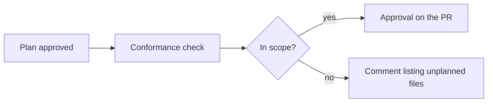

Change control connects plan approvals in Ref to pull requests on GitHub.

- **Conformance checks** show whether a pull request matches its approved plan.
- **Approval forwarding** posts plan approvals on the pull request as GitHub reviews.

## How it works

1. **Link a PR to a plan.** PRs that agents open from a plan are linked automatically. You can also paste the plan link into the PR description.
2. **Ref checks the PR against its plan.** `Ref: plan approved` shows whether the plan is approved. `Ref: plan conformance` shows whether each changed file is in the plan. Both update on every push.
3. **Plan approvals are forwarded to the PR.** When a teammate approves the plan with a [review](/plans/collaboration/reviews), Ref posts that approval on the PR from their GitHub account, if forwarding is on.
4. **Ref records each merge,** and whether it had an approved plan. Find them in **Settings > Change control**, or [get Slack alerts](#set-it-up) when something merges without one.

If a PR has changes the plan doesn't cover, conformance lists those files. You can add them to the plan and get it approved again, or move them to another PR.

### Forwarding

By default, if the PR matches the plan, Ref posts an approval. If it has unplanned changes, Ref posts a comment that lists those files.

## Set it up

A team admin sets this up in **Settings > Change control**.

1. **Add repositories.** Install the Ref GitHub App on your GitHub organization, then pick your repositories. The App posts the checks. An org owner may need to approve it.
2. **Record every merge.** This starts when you add a repository.
3. **Forward plan approvals to GitHub.** Turn this on to post approvals on PRs.
4. **Require an approved plan to merge.** Optional. Also mark `Ref: plan approved` as required in your GitHub ruleset.

To get Slack alerts, [connect Slack](/plans/integrations/slack), then pick a channel under **Alerts** in **Settings > Change control**.

Each teammate should connect GitHub in **Settings > GitHub**, so their approvals post from their own account.

## Tips

- **Start with recording.** Turn on forwarding once your team is used to it.
- **Write the plan first,** especially for agent work.
- **Protect sensitive code.** List paths like auth or billing in `.ref/risk-paths.yml`. Then turn on "Risky paths also need a pull request approval" in **Approvals**, so those files need a code review too.
- **Skip generated files.** List them in `.ref/scope-exempt.yml` at the repository root so conformance ignores them.
- **Skip plans for small fixes.** Turn on "A pull request approval also counts" in **Approvals**.
