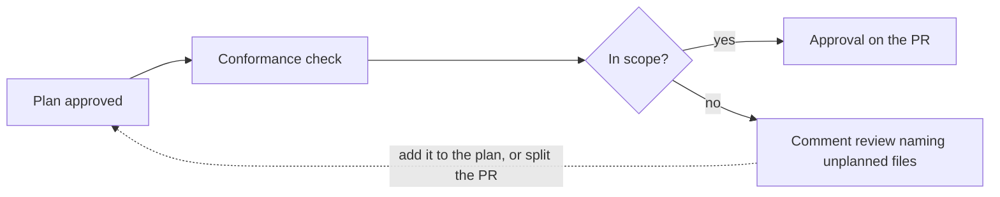

Your team plans in Ref before building, and teammates approve the plan in a [review](/plans/collaboration/reviews). Change control carries that approval over to GitHub:

- **Conformance checks** look at each pull request and tell you whether it matches its approved plan. They show up on the PR next to your tests.
- **Approval forwarding** turns a plan approval into a GitHub review on the PR, so nobody has to approve the same work twice.

Nothing changes on a repository until a team admin adds it.

## How it works

1. **Link the PR to a plan.** PRs an agent opens from a plan are linked for you. Otherwise, paste the plan's link into the PR description, or add the PR from the plan's Pull Requests menu.
2. **Teammates approve the plan in Ref.** The plan owner's own approval never counts, so someone else has to approve it.
3. **Ref posts two checks on the PR.** Ref updates them on every push.
4. **Ref forwards the approval, if you turned that on.** Each approver's approval appears on the PR as a review from their own GitHub account.
5. **Ref records the merge.** Each merge is marked Approved, PR approved, Not approved, No plan, or Bypassed.

### The two checks

| Check | What it tells you | Can it block a merge? |
| --- | --- | --- |
| Ref: plan approved | Whether the linked plan is approved, and by whom | Only if you turn on blocking |
| Ref: plan conformance | Whether each changed file fits the approved plan: In scope, Unplanned changes, or Skipped | No. It is advice only |

Conformance compares the code to the version of the plan that was approved, not later edits. It takes about 30 seconds. When it finds unplanned changes, the check says what to do: add them to the plan and ask for approval again, or move them to another PR.

### Forwarding

By default, forwarding follows conformance. A PR that stays in scope gets the approval. A PR with unplanned changes gets a comment review that names those files instead, so a reviewer looks at them.

## Set it up

A team admin sets this up once, under **Settings > Change control** in Ref Plans. Each step can be turned off again, and every change is saved to the page's history.

1. **Add your repositories.** Install the Ref GitHub App if asked, then pick repositories. For each one, choose which PRs it covers: Everyone, Ref users (people on your Ref team who connected GitHub), or a GitHub team.
2. **Record every merge.** This turns on as soon as a repository is added. Both checks start showing on PRs. Nothing is blocked.
3. **Forward plan approvals to GitHub.** Off until you turn it on. Then choose where approvals go: In-scope pull requests (the default) or All linked pull requests.
4. **Require an approved plan to merge.** Optional, and set per repository. To actually hold merges, also mark the `Ref: plan approved` check as required in the repository's ruleset on GitHub.

Three more choices sit under **Approvals**:

- **Plan approvals needed:** how many people, besides the plan owner, must approve a plan. A "changes requested" review always holds the merge.
- **A pull request approval also counts:** a normal GitHub approval can stand in for a plan. Useful for small fixes.
- **Risky paths also need a pull request approval:** paths listed in `.ref/risk-paths.yml` always get a code review, even with an approved plan.

Under **Alerts**, you can pick a Slack channel for warnings and bypasses.

Each teammate should also connect GitHub under **Settings > GitHub**. Ref can only forward approvals from people who have.

To keep generated or vendored files out of conformance, list their paths in `.ref/scope-exempt.yml` at the root of the repository.

## Tips for rolling it out

- **Start by watching.** Turn on recording only for a week or two. Add forwarding and blocking once they'd help.
- **Write the plan before the code,** especially for agent work. If conformance flags a file, add it to the plan or move it to its own PR.
- **Not everything needs a plan.** Turn on "A pull request approval also counts" so small fixes keep your normal code review.

## Good to know

- **You need at least two people.** An owner can't approve their own plan, and Ref doesn't forward an approval to a PR its approver opened.
- **Conformance is an AI judgment.** It can be wrong, which is why it never blocks a merge. Read it as a pointer to where a reviewer should look.
- **Forwarded reviews are real GitHub reviews.** They come from the approver's own account and count toward your required reviews.
- **Changes refresh on the next push.** When a PR or a setting changes, reviews already posted stay until that PR is next updated.
- **Repositories you don't add are untouched.** No checks, no reviews, no records.
