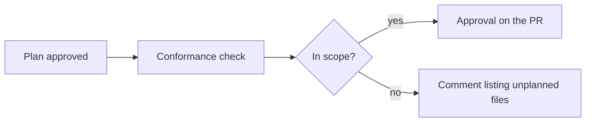

Change control connects plan approvals in Ref to pull requests on GitHub.

- **Conformance checks** show whether a pull request matches its approved plan.
- **Approval forwarding** posts plan approvals on the pull request as GitHub reviews.

## How it works

1. **Link a PR to a plan.** PRs that agents open from a plan are linked automatically. You can also paste the plan link into the PR description.
2. **A teammate approves the plan** with a [review](/plans/collaboration/reviews).
3. **Ref adds two checks to the PR.** They update on every push.
4. **Ref posts the approval on the PR,** if forwarding is on. It shows as a review from the approver's GitHub account.
5. **Ref records each merge.**

### The two checks

| Check | What it shows |
| --- | --- |
| Ref: plan approved | Whether the plan is approved, and by whom |
| Ref: plan conformance | Whether each changed file is in the plan |

If a PR has changes the plan doesn't cover, conformance lists those files. You can add them to the plan and get it approved again, or move them to another PR.

### Forwarding

By default, if the PR matches the plan, Ref posts an approval. If it has unplanned changes, Ref posts a comment that lists those files.

## Set it up

A team admin sets this up in **Settings > Change control**.

1. **Add repositories.** Install the Ref GitHub App and pick your repositories.
2. **Record every merge.** This starts when you add a repository.
3. **Forward plan approvals to GitHub.** Turn this on to post approvals on PRs.
4. **Require an approved plan to merge.** Optional. Also mark `Ref: plan approved` as required in your GitHub ruleset.

Each teammate should connect GitHub in **Settings > GitHub**.

<Tip>
To skip generated files in conformance, list them in `.ref/scope-exempt.yml` at the repository root.
</Tip>

## Tips

- **Start with recording.** Turn on forwarding once your team is used to it.
- **Write the plan first,** especially for agent work.
- **Protect sensitive code.** List paths like auth or billing in `.ref/risk-paths.yml`. Then turn on "Risky paths also need a pull request approval" in **Approvals**, so those files need a code review too.
- **Skip plans for small fixes.** Turn on "A pull request approval also counts" in **Approvals**.
