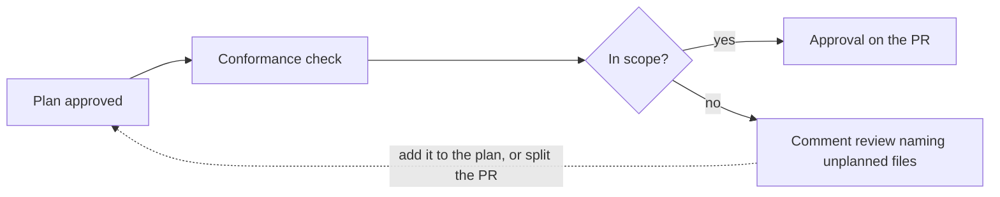

Your team already agrees on the plan before building. Change control carries that agreement to GitHub, so a plan approval does the work of a code approval on every pull request that follows the plan.

It brings two things to your pull requests:

- **Conformance checks** show how each pull request lines up with its approved plan, right next to your tests.
- **Approval forwarding** posts each plan approval on the pull request as a GitHub review, so reviewers approve the work once.

## How it works

1. **Link the PR to a plan.** PRs an agent opens from a plan are linked automatically. You can also paste the plan's link into the PR description, or add the PR from the plan's Pull Requests menu.
2. **A teammate approves the plan in Ref,** through a [review request](/plans/collaboration/reviews).
3. **Ref posts two checks on the PR** and keeps them current on every push.
4. **Ref forwards the approval.** Each approver's approval appears on the PR as a review from their own GitHub account, and counts toward your required reviews.
5. **Ref records the merge,** so you can see at a glance which merges followed an approved plan.

### The two checks

| Check | What it shows |
| --- | --- |
| Ref: plan approved | The linked plan, who approved it, and when |
| Ref: plan conformance | How each changed file fits the approved plan: In scope, Unplanned changes, or Skipped |

Conformance reads the code against the version of the plan your team approved, and posts its result in about 30 seconds. When it spots unplanned changes, it points reviewers to those files and suggests next steps: add the work to the plan, or move it to its own PR.

### Forwarding

With the recommended In-scope setting, forwarding follows conformance. A PR that sticks to the plan gets the approval. A PR with unplanned changes gets a comment review naming those files, so reviewers know exactly where to look.

## Set it up

A team admin sets this up under **Settings > Change control** in Ref Plans.

1. **Add your repositories.** Install the Ref GitHub App, then pick repositories. For each one, choose which PRs it covers: Everyone, Ref users (people on your Ref team who connected GitHub), or a GitHub team.
2. **Record every merge.** This starts as soon as you add a repository, and both checks begin showing on PRs.
3. **Forward plan approvals to GitHub.** Turn this on when you're ready, then choose where approvals go: In-scope pull requests (recommended) or All linked pull requests.
4. **Require an approved plan to merge.** When your team is ready, turn this on per repository and mark the `Ref: plan approved` check as required in the repository's GitHub ruleset.

Under **Approvals**, tune how approvals count:

- **Plan approvals needed:** how many teammates approve each plan.
- **A pull request approval also counts:** lets a normal GitHub approval cover small fixes that don't need a plan.
- **Risky paths also need a pull request approval:** paths listed in `.ref/risk-paths.yml`, like auth or billing, always get a code review too.

Under **Alerts**, pick a Slack channel to follow activity.

Finally, ask each teammate to connect GitHub under **Settings > GitHub**, so their plan approvals can be forwarded.

<Tip>
To keep generated or vendored files out of conformance, list their paths in `.ref/scope-exempt.yml` at the root of the repository.
</Tip>

## Tips for rolling it out

- **Start with recording.** Spend a week or two seeing how your merges line up with plans, then turn on forwarding.
- **Write the plan before the code,** especially for agent work. Conformance then tells you when a PR has grown past the plan.
- **Keep small fixes simple.** Turn on "A pull request approval also counts" so quick fixes keep your normal code review.
