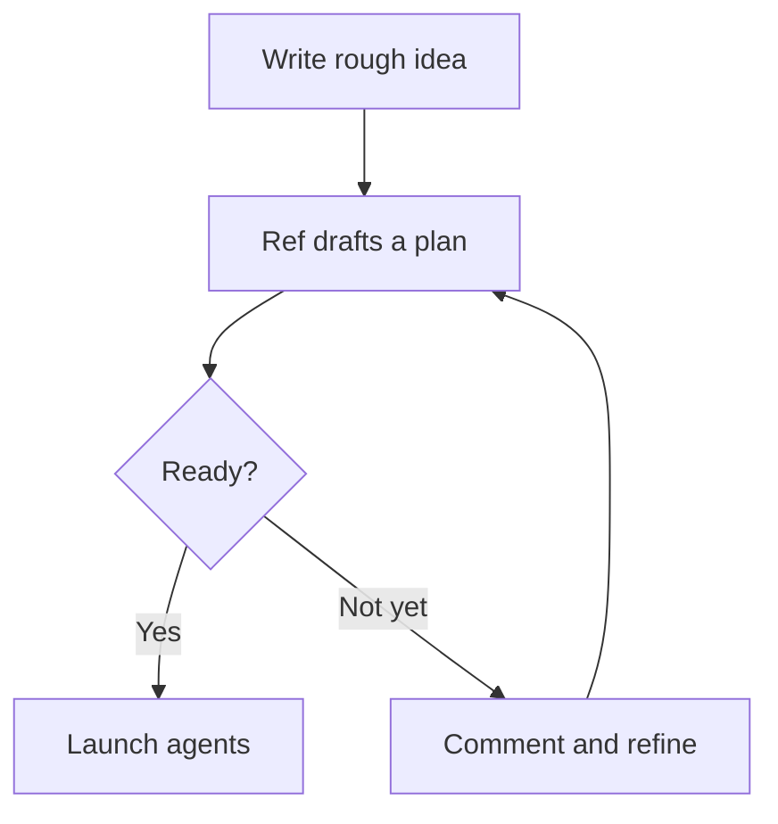

Ref Plans support more than plain markdown. Use rich content when screenshots, diagrams, prototypes, or long supporting details make the plan easier to understand.

## Images

Drag an image file onto the doc or paste one from your clipboard to insert it. Standalone images with no explicit width render at most about 480px tall, based on their intrinsic dimensions, and scaled-down images are centered so smaller screenshots do not hug the left edge. Existing docs get this cap automatically; nothing needs to be rewritten. Click an image to open it in a lightbox for the full-size view.

Click below an image to add or edit its caption. Drag a corner handle to resize a standalone image. Click an image to select it; press **Backspace** to delete the selected image.

Two or more image lines with no blank line between them render side by side as one grid, with up to three equal-width cells per row before wrapping. This uses normal markdown image syntax, so the same lines stay portable and render as stacked images on GitHub.

```markdown


```

Add a blank line between image lines to split them back into standalone blocks.

```markdown


```

For agents, the caption is what they see inline as a lightweight placeholder on every read. Agents view the actual pixels with `Media` (`action: 'view'`), which returns a signed URL or inline pixels when the client cannot fetch one (`size` is thumb, standard, or original). Agents upload and place new images with the same tool.

When an agent already has an image URL, such as a short-lived Figma MCP asset URL like `https://www.figma.com/api/mcp/asset/...`, it can call `Media` with `action: 'upload'` and `url` to let the server fetch and store the image. That returns a `mediaId`, which the agent then passes to `Media` with `action: 'insert'`, the target line, and optional alt text.

If the agent has raw image bytes instead, it can use the signed-URL flow: call `Media` with `action: 'upload'` and `mimeType`, PUT the bytes to the returned `uploadUrl`, then call `Media` with `action: 'insert'` and the same `mediaId`.

`Media` with `action: 'insert'` also accepts an optional `displayWidth` integer from 120 to 2000. It sets the rendered width in pixels for a standalone image and writes the same `w` URI parameter that the editor's drag-resize handle writes, such as ``. `displayWidth` is ignored for images inside a grid, where cells are equal-width; omit it when you want the default height cap.

To build a browsable layout, call `Media` with `action: 'insert'` at successive `afterLine` values so the image lines land adjacent and form a grid. Use `displayWidth` when you want one standalone image at a specific size.

## Mermaid diagrams

Fenced ```` ```mermaid ```` code blocks render as live diagrams inline. They include zoom and expand controls, and their styling is theme-aware so diagrams match light and dark mode. In the expanded view, scroll to zoom toward the cursor and drag to pan. Double-click to reset to the fitted view; press **Escape** to close the overlay.



## HTML widgets

Fenced ```` ```html-ref ```` code blocks render as sandboxed, interactive HTML. They are useful for wireframes, dashboards, and prototypes right inside the plan.

Individual DOM nodes inside an HTML widget can be commented on directly, so reviewers can leave feedback on the exact part of a prototype or visualization they mean.

```html-ref
<div style="font-family: system-ui; padding: 16px; border: 1px solid #d4d4d4; border-radius: 12px; max-width: 320px;">
  <h3 style="margin: 0 0 8px;">Launch checklist</h3>
  <p style="margin: 0 0 12px;">Review the plan, then start agents.</p>
  <button style="background: #1a1a1a; color: white; border: 0; border-radius: 8px; padding: 8px 12px;">
    Launch agents
  </button>
</div>
```

## Collapse blocks

Use collapse blocks for long detail sections, like big file lists, that should default to collapsed.

```mdx
:::collapse
## Files — 12 files, 4 directories
Mostly in `src/components/` and `src/lib/`
:::
- `src/components/Editor.tsx` - root editor component
- `src/lib/wysiwygPlugin.ts` - decoration engine
:::end
```

`:::collapse` opens the block. Everything between `:::collapse` and the bare `:::` is the header region: it is always visible, editable markdown, and should usually start with a heading like `## Files — 12 files, 4 directories`.

Everything between the bare `:::` and `:::end` is the body region. It is appended below the header when expanded and hidden when collapsed.

A collapse block must close with `:::end` or it renders as plain text.

Nesting is supported. A completed task can wrap a collapsed file list inside its own collapse block:

```mdx
:::collapse
# Task 1: ✅ Verb-Noun Name
:::
…completed-task detail…
:::collapse
## Files — 12 files, 4 directories
:::
- file list
:::end
…more detail…
:::end
```

Each `:::end` closes only the innermost open block, so every `:::collapse` needs its own matching `:::end`. Nesting works in the body of a collapse block (after the bare `:::` separator), not in the header region between `:::collapse` and the separator.

## Callouts

Use a callout when one warning, prerequisite, or gotcha should stand out from the rest of the plan.

```markdown
> [!WARNING]
> Review the proposed tasks before launching agents. A bad split is cheaper to fix here than after three PRs are open.
```

<Frame>
  
  
</Frame>

The first line of the blockquote is the marker: `> [!TYPE]`. The lines after it are the body.

Five types, written for the person reading the plan:

- **Note** — extra context you should notice while skimming
- **Tip** — a better or easier way to do something
- **Important** — something you need in order to succeed
- **Warning** — be careful here; skipping this leads to problems
- **Caution** — this action is destructive. Ref follows GitHub in treating Caution, not Warning, as the destructive type.

`[!INFO]` is a Note, `[!HINT]` is a Tip, and `[!DANGER]`, `[!ERROR]`, `[!FAILURE]`, and `[!BUG]` are Caution.

You can add a custom title after the marker:

```markdown
> [!WARNING] Review before launch
> Read the agent's proposed tasks and implementation steps. Catch issues before anyone starts coding.
```

<Frame>
  
  
</Frame>

`> [!TIP]-` opens collapsed, `> [!TIP]+` opens expanded, and a bare `> [!TIP]` is not collapsible — Obsidian's rule, so existing callouts do not change. The author's `+` or `-` only decides the first load; after that the fold state is the reader's.

<Frame>
  
  
</Frame>

<Frame>
  
  
</Frame>

The marker must be the first line of the blockquote. A `[!WARNING]` later in the quote is just text.

The same markdown is a callout in Obsidian. On GitHub, only a bare `> [!TIP]` is an alert; `> [!TIP]-`, `> [!TIP]+`, and a custom title render as a plain block quote with the marker visible as text.

Agents write Mermaid diagrams, HTML widgets, collapse blocks, and callouts automatically when they are relevant, such as auto-collapsing long file lists. Ask Ref for a wireframe/diagram to discover widgets.
