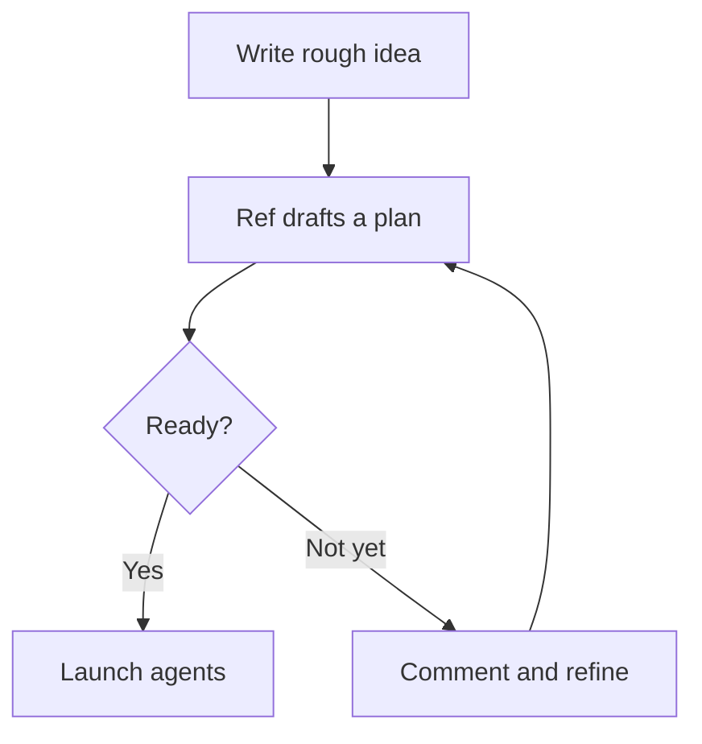

Ref Plans support more than plain markdown. Use rich content when screenshots, diagrams, prototypes, or long supporting details make the plan easier to understand.

## Images

Drag an image file onto the doc or paste one from your clipboard to insert it. Images are full width by default, and scaled-down images are centered so smaller screenshots do not hug the left edge.

Click below an image to add or edit its caption. Drag a corner handle to resize it. Click an image to select it; press **Backspace** to delete the selected image. Click an image to open it in a lightbox for a closer look.

For agents, the caption is what they see inline as a lightweight placeholder on every read, and agents can view the actual pixels or upload new images via the Ref Plans MCP server tools.

## Mermaid diagrams

Fenced ```` ```mermaid ```` code blocks render as live diagrams inline. They include zoom and expand controls, and their styling is theme-aware so diagrams match light and dark mode.



## HTML widgets

Fenced ```` ```html-ref ```` code blocks render as sandboxed, interactive HTML. They are useful for wireframes, dashboards, and prototypes right inside the plan.

Individual DOM nodes inside an HTML widget can be commented on directly, so reviewers can leave feedback on the exact part of a prototype or visualization they mean.

```html-ref
<div style="font-family: system-ui; padding: 16px; border: 1px solid #d4d4d4; border-radius: 12px; max-width: 320px;">
  <h3 style="margin: 0 0 8px;">Launch checklist</h3>
  <p style="margin: 0 0 12px;">Review the plan, then start agents.</p>
  <button style="background: #1a1a1a; color: white; border: 0; border-radius: 8px; padding: 8px 12px;">
    Launch agents
  </button>
</div>
```

## Collapse blocks

Use collapse blocks for long detail sections, like big file lists, that should default to collapsed.

```mdx
:::collapse
## Files — 12 files, 4 directories
Mostly in `src/components/` and `src/lib/`
:::
- `src/components/Editor.tsx` - root editor component
- `src/lib/wysiwygPlugin.ts` - decoration engine
:::end
```

`:::collapse` opens the block. Everything between `:::collapse` and the bare `:::` is the header region: it is always visible, editable markdown, and should usually start with a heading like `## Files — 12 files, 4 directories`.

Everything between the bare `:::` and `:::end` is the body region. It is appended below the header when expanded and hidden when collapsed.

A collapse block must close with `:::end` or it renders as plain text.

Agents write Mermaid diagrams, HTML widgets, and collapse blocks automatically when they are relevant, such as auto-collapsing long file lists. Ask Ref for a wireframe/diagram to discover widgets.
