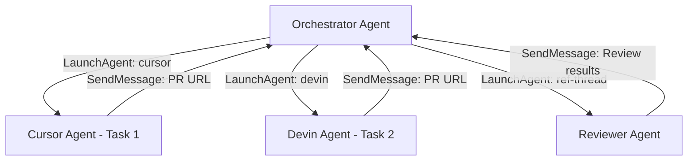

import GetHelp from '/snippets/get-help.mdx';

Multi-agent orchestration lets a Ref agent (the orchestrator) spawn sub-agents on Cursor, Devin, or internal ref-threads, send them messages, and receive updates back — all via MCP tools. This is the most automated way to use Ref Plans.

## How it works

An orchestrator agent reads your plan, then launches child agents to implement and review tasks in parallel. The agents communicate through a parent/child messaging system — no polling required.

## The tools

Two MCP tools power orchestration:

### LaunchAgent

Launches a sub-agent to work in parallel. Available harness types:

| Harness | Use for | What it does |
| --- | --- | --- |
| `cursor` | Implementation tasks | Launches a Cursor background agent that writes code and creates PRs |
| `devin` | Implementation tasks | Launches a Devin session that writes code and creates PRs |
| `ref-thread` | Review and lightweight tasks | Launches an internal Ref agent that can read PRs, review diffs, approve, and merge |

Key parameters:
- **`planIds`** — Plan IDs the agent should be associated with
- **`prompt`** — The complete task request with all context, requirements, and instructions
- **`harness`** — Where to run the agent: `cursor`, `devin`, or `ref-thread`
- **`taskShortDescription`** — Brief label for the agent (~10 words)
- **`repo`** / **`branch`** / **`model`** — Optional overrides (Cursor only)

### SendMessage

Sends a message between parent and child agents. This is how agents communicate:

- **Child agents** MUST message their parent when work is complete (including the PR URL) or when stuck
- **Parent agents** use this to send follow-up instructions or course corrections

Parameters:
- **`agentId`** — The agent to send the message to
- **`message`** — The message content

## Typical workflow

<Steps>
  <Step title="Plan">
    Research and iterate on your plan in the web client or via MCP. Break work into tasks that can be implemented independently.
  </Step>
  <Step title="Orchestrate">
    An orchestrator agent reads the plan and launches implementation agents (Cursor, Devin) in parallel via `LaunchAgent`. Each agent gets a self-contained prompt with all the context it needs.
  </Step>
  <Step title="Review">
    As implementation agents finish and report back with PR URLs, the orchestrator launches `ref-thread` agents to review each PR. Reviewers have access to GitHub tools (`ReadPR`, `ReviewPR`, `MergePR`) to inspect diffs and approve.
  </Step>
  <Step title="Merge and update">
    Once reviewers approve, they merge the PRs (if permitted). The orchestrator updates the plan to mark tasks complete. Repeat until the plan is done.
  </Step>
</Steps>

## Example session

Here's what a typical orchestration session looks like:

1. The orchestrator reads the plan and identifies three independent tasks
2. It launches two Cursor agents for Task 1 and Task 2 in parallel, and a Devin agent for Task 3
3. Task 1's agent finishes first and messages back: *"Task complete. PR: https://github.com/org/repo/pull/42"*
4. The orchestrator launches a ref-thread reviewer to review PR #42
5. Task 2's agent finishes and messages back with its PR URL
6. The reviewer approves and merges PR #42, then messages the orchestrator with results
7. The orchestrator updates the plan, marking Task 1 complete
8. The process continues until all tasks are implemented, reviewed, and merged

## Harness selection guide

**Use `cursor` or `devin` for implementation** — these agents write code, create branches, and open PRs. Choose based on which service you have configured and prefer.

**Use `ref-thread` for reviews** — ref-thread agents have access to GitHub PR tools (`ReadPR`, `ReviewPR`, `MergePR`, `SearchPRs`) that Cursor and Devin agents do not. Always use ref-thread for PR review tasks.

## Requirements

To use multi-agent orchestration, you need:

1. **Ref Plans MCP server installed** in your orchestrating agent — see the [install guide](/plans/install/index)
2. **Agent orchestration enabled** in [Factory Settings](https://plan.ref.tools/settings) — toggle on the master switch and enable the harnesses you want to use
3. **API keys configured** for Cursor and/or Devin in [Agent Settings](https://plan.ref.tools/settings) — required for `cursor` and `devin` harnesses
4. **GitHub connected** at [ref.tools/resources](https://ref.tools/resources) — required for ref-thread reviewers to access PR tools

## Parent/child messaging rules

- Child agents **must** message their parent when done (include the PR URL if one was created) or when stuck
- Parents can send follow-up instructions or corrections to any child via `SendMessage`
- Agents can only message their direct parent or their own children — no cross-communication
- The workflow is message-driven: after launching agents, wait for messages rather than polling

<GetHelp/>
